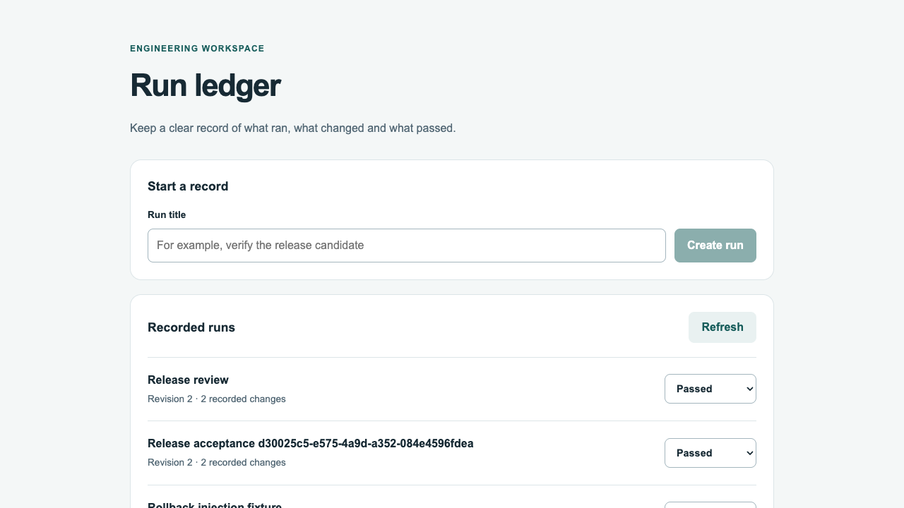

# Typed run-ledger application

A small working application for recording an engineering run and changing its
status. Next.js/React supplies the interface, FastAPI defines and validates the
API, and PostgreSQL commits the run and its history together. A stale revision
returns a conflict instead of silently overwriting a newer update. The interface
shows the entered status; it does not certify that a test actually passed.



## Accepted stack and source review

The September 20, 2026 check retained Next.js **16.3.5**, React/React DOM **19.3.0**,
FastAPI **0.141.1** and PostgreSQL **18.6**. Node **24.21.0**, pnpm **12.4.2**,
Python **3.14.7**, uv **0.12.17**, Playwright Test **1.63.0** and installed Chrome
**153.0.8010.53** were used on this Mac. [sources.json](sources.json) records
package metadata hashes, source revisions, licenses and PostgreSQL artifact
identities. This is a dated qualification, not an automatic latest-version rule.

Two compatibility decisions were made from actual evidence. The latest
TypeScript 7.0.2 failed the current OpenAPI generator's declared `^5.x` peer and
native type generation. The accepted project pins the latest supported
TypeScript **5.9.3**, with openapi-typescript **7.13.0**. The initial API tests
passed with HTTPX but exposed its deprecation in the installed Starlette
TestClient; the final test dependency is the explicitly preferred, verified
Pydantic **httpx2 2.13.0**. An upstream AnyIO alias deprecation remains recorded.
pnpm 12.5.1 was available; the already qualified 12.4.2 was retained. No global
tool upgrade or package lifecycle script was needed.

The native commands follow [Next installation/build conventions](https://nextjs.org/docs/app/getting-started/installation),
[FastAPI's Uvicorn deployment interface](https://fastapi.tiangolo.com/deployment/manually/),
[PostgreSQL's source installation](https://www.postgresql.org/docs/18/install-make.html),
and [Alembic migrations](https://alembic.sqlalchemy.org/en/latest/tutorial.html).
PostgreSQL 18.6 is the stable release dated August 13, 2026; the reviewed 19 beta
was not selected. [PostgreSQL release notes](https://www.postgresql.org/docs/release/18.6/)

## Reproduce locally

Run these commands from this application directory with the recorded runtimes,
Apple Command Line Tools, Make, curl, tar and Chrome available. Check that
loopback ports 15432, 18080 and 18081 are free. The source build installs only
under `.runtime/postgresql/18.6`; source/archive/build files, database state,
application logs and package caches stay in the ignored `.runtime` directory.

```sh
make setup
make postgres-install
make postgres-init
make postgres-start
make postgres-databases
make migrate migrate-test
make verify
```

`postgres-install`, `postgres-init` and `postgres-databases` are one-time setup
steps. Installation and initialization refuse existing destinations; do not
delete an existing database to make them pass. Later runs use `make setup`,
`make postgres-start` when stopped, `make migrate migrate-test`, then
`make verify`. Alembic's repeated upgrade was exercised and is idempotent.

`make verify` performs peer checks, API/schema/generated-type drift checks,
TypeScript checking, the production build,
12 API/database tests and one browser workflow. Playwright starts and stops its
own API and Next processes and uses a fresh browser context; it refuses to reuse
an existing server on the application port. The browser title is unique per run,
so retained test rows do not prevent repeat execution. API tests target only
`ledger_test` and fail before writes if a different database is selected.

To use the interface separately:

```sh
make run
# Open http://127.0.0.1:18080; Ctrl-C stops both application processes.
# After stopping the application:
make postgres-stop
```

After changing API models, run `make schema` to regenerate the checked-in
`openapi.json` and `app/api.generated.ts`. Do not edit the generated types by hand.
The nested [project contract](project-contract.json) supplies actual setup, run,
test and verify commands for native Codex/Claude integration. The enclosing
repository's global actions were not modified by this bounded contribution.

## Recipe portability follow-up

The current PostgreSQL build/install entrypoints explicitly reset `MAKELEVEL=0`
at the external source-tree boundary. PostgreSQL's own recursive make calls still
advance normally. This prevents the enclosing application Makefile from causing
PostgreSQL to skip its top-level generated-header prerequisites. The application
port probe now uses `SO_REUSEADDR`, allowing normal restart after TIME_WAIT while
still refusing a live listener. It does not enable `SO_REUSEPORT` or stop any
unknown process.

Five focused tests exercise both actual make command boundaries, reproduce the
old recursion failure, create real loopback TIME_WAIT and live-listener sockets,
and check historical byte identity. They pass on the Mac without rebuilding the
application or PostgreSQL:

```sh
python3 -m unittest discover -s blueprints/convergence-practice/application-delivery -p 'test_portability.py' -v
```

Run that command from the repository root. The [recipe revision mapping](history/recipe-revisions.json)
preserves the original Makefile and launcher bytes under their recorded hashes.
The original receipt and experiment are unchanged and still describe that earlier
recipe. These portability checks qualify only the two changes; later WSL full-stack
acceptance is recorded separately.

## Qualification and limits

[acceptance-plan.json](acceptance-plan.json) fixed the acceptance criteria;
[freeze.json](freeze.json) preserves the initial and final oracle hashes.
[receipt.json](receipt.json) records results and retained failures. All 12 API
checks, generated type checking, the production build, and the real browser
create/update workflow passed. The browser-created record survived a native
PostgreSQL stop/start and API/Next restart byte-for-byte, including its ID,
timestamps, status, revision and history count. A separate Playwright CLI session
also created and updated a record and had zero final console errors.

The initial official PostgreSQL container image downloaded successfully, but
its Documents-directory bind mount stalled before guest boot. The coordinator
subsequently qualified an owned named-volume container route separately. This
application's full-stack receipt uses the **actual native PostgreSQL 18.6 source
build**; container storage acceptance is a separate result and is not silently
substituted for the application's observed database.

The native build intentionally omits ICU, readline, zlib and TLS support, with
UTF-8/C locale, loopback TCP only and no Unix socket listener. Its local trust
authentication is restricted to this synthetic fixture. It is not a production
database installation, shared-user service, or deployment recommendation. The
archive matches the publisher SHA-256; the PostgreSQL license is retained in the
source and installed prefix. No driver, daemon, account store, shared container
configuration or global PATH was changed by the application worker.

This vertical slice has no authentication/authorization, paging beyond its most
recent 100 records, external run ingestion, hosted deployment, production load
test or backup/independent-host restore acceptance. No model, provider, broker
or trading operation was invoked. Whole-task model usage is unknown and no
token-saving claim is made. Keep future real data out of this acceptance database.

Rollback is to stop the owned application and native database first, preserve
needed records/evidence, then remove only this task-owned runtime installation
and data after review. Reverting the code commit alone does not remove data.

## Separate migration reversal check

The coordinator additionally qualified upgrade → downgrade-to-base → upgrade in
a new empty synthetic database, then removed that database and stopped the owned
cluster. The [separate receipt](migration-rollback.json) records all10 command
exits and exact schema names. The original application databases were unchanged.
Downgrade drops both application tables; this proves schema reversal, not user-data
recovery or production-safe rollback.

## macOS re-qualification at the 2026-09-24 pins

The 2026-09-24 catalog pin bumps (uv 0.12.18, pnpm 12.6.0) were re-qualified on the
Mac host `macos-m5pro-20260924`. [experiment-macos-20260924.json](experiment-macos-20260924.json)
records all 15 attempts, including the failed ones. pnpm 12 stores its own version in
`pnpm-lock.yaml` as well as in `packageManager`, so this project keeps running pnpm
12.4.2 whatever the global pin is. The qualifying run used a scratch copy with only that
self-pin raised to 12.6.0. The two changed files are retained under
[the variant evidence](../../../evidence/artifacts/macos-application-20260924/variant/), and the
lockfile's project dependency section is byte-identical to the committed one. The
committed recipe keeps its pnpm 12.4.2 self-pin so that [experiment.json](experiment.json)
stays valid; moving the recipe itself needs a new frozen record.

The sandbox-scope attempts show which steps the Claude Code Bash sandbox blocks:
pnpm registry and store operations, PostgreSQL `initdb` shared memory and loopback
database connections. Run the database and pnpm steps in the native shell.
