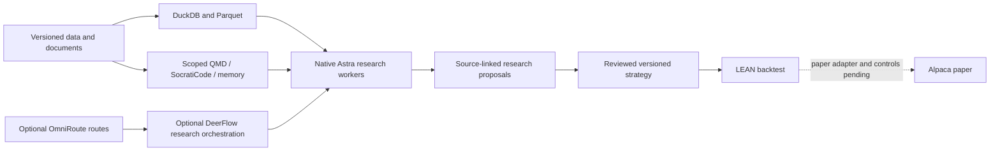

# US-equities research → backtest → Alpaca paper foundation

**September 19, 2026:** native components below were installed and exercised on
Linux/WSL. The selected path is **research/backtesting first, Alpaca paper next**.
The existing [36-component agent stack](../../docs/stack.md) supplies shared
context, memory, RAG, collaboration and evidence practices. This extension is a
working research/backtest foundation, not a claim of a complete trading system
or a universally final SOTA ranking.

The broker side must own numeric validation, order state and reconciliation.
Models produce research and proposed code; they do not own broker credentials
or an unrestricted order-submission tool.

Read the [north-star architecture and acceptance boundaries](north-star.md),
[grand repository catalog](../../catalogs/us-equities/README.md), and
[machine-readable harness contract](harness-contract.json) for the integrated path.

## Selected stack and actual acceptance

| Layer | Upstream selection | Status and evidence |
| --- | --- | --- |
| Native agents | [OpenAI Codex](https://github.com/openai/codex), [Claude Code](https://github.com/anthropics/claude-code) | Existing native ecosystem; this extension ran one native Astra SDK research task. It did not rerun Claude. |
| Worker SDK | [Codex SDK](https://learn.chatgpt.com/docs/codex-sdk), `openai-codex 0.154.0`, native Codex `0.155.1` | Installed; sign-in, model/allowance discovery and real task completed; [commands and usage](workers/README.md). |
| Research harness | [DeerFlow](https://github.com/bytedance/deer-flow), pinned `42334f2` | Backend `2.1.0-rc0` installed; 23 skills, healthy native HTTP backend. Distinct from stable `2.0.0`; no model configured in its own SDK. [Proof](deerflow/README.md). |
| Native agent protocol | [Codex ACP](https://github.com/agentclientprotocol/codex-acp) `1.12.0` | Installed; protocol/session discovery passed. DeerFlow→ACP→completed inference remains unproved. |
| Optional routers | [OmniRoute](https://github.com/diegosouzapw/OmniRoute) `3.8.50`, [FreeLLMAPI](https://github.com/tashfeenahmed/freellmapi) `0.11.0` | Existing installations healthy; explicit historical Qwen/Opus routes. GPT‑6 through a gateway remains unproved. [Native settings and limits](routing/README.md). |
| Large outputs and local retrieval | [Context Mode](https://github.com/mksglu/context-mode), [RTK](https://github.com/rtk-ai/rtk), scoped QMD, Serena, SocratiCode | Existing stack; real Astra worker used Context Mode in this run. One file-scope failure retained. See [full baseline manifest](../../manifests/stack.json) for repository identities and pins. |
| Shared memory and local RAG | [ai-memory](https://github.com/akitaonrails/ai-memory), SocratiCode, Qdrant, vLLM/Nemotron embeddings | Existing agent-lab scope and automatic refresh evidence retained; publication/new projects require deliberate adoption. No duplicate DeerFlow memory store enabled. |
| Data computation | [DuckDB](https://github.com/duckdb/duckdb) `1.5.5`, [exchange_calendars](https://github.com/gerrymanoim/exchange_calendars) `4.13.2` | Installed; LEAN event JSON→Parquet→SQL counts/calendar completed. [Commands](data/README.md). |
| Backtest engine | [QuantConnect LEAN](https://github.com/QuantConnect/Lean), pinned `985ef30`, .NET `10.0.401` | Native source build and unchanged bundled sample passed: 3,943 data points, three simulated orders. [Receipt and replay](engine/README.md). |
| Paper execution target | [LEAN Alpaca adapter](https://github.com/QuantConnect/Lean.Brokerages.Alpaca), reviewed `1973f61`; [alpaca-py](https://github.com/alpacahq/alpaca-py) `0.44.0` | SDK installed; adapter selected but not installed/exercised. No paper credentials or broker connection; no orders submitted. |
| Direct model API alternative | [OpenAI Python](https://github.com/openai/openai-python) `3.16.2` | Installed, no API key or paid API request. Native subscription access is not API authorization. |
| Hosting and observability | Native processes now; service templates/managed hosts only after scope is set | [Hosting guide](hosting.md); private native receipts, elapsed time, usage, warnings and hashes retained. No public endpoint or standing trading service deployed. |

These are complementary layers. They are not all stacked on every request.
DeerFlow already uses LangGraph; another orchestration framework is not needed
for this proof. Temporal is a possible later durable workflow layer, not an
installed dependency. NautilusTrader remains a comparison candidate: the reviewed
stable release has no official Alpaca adapter. vectorbt is optional analysis
software with a Commons Clause license addition; it is not adopted as the engine.
See [the dated manifest](manifest.json) and [coverage limits](../../docs/convergence-audit.md).

## What ran and what remains

- **Ran:** native SDK inference with Context Mode; native DeerFlow health and
  ACP discovery; pinned LEAN build/backtest; deterministic Parquet/SQL/calendar
  processing; fresh router health checks. The manifest links the exact receipts.
- **Measured:** the successful research turn used 133,839 input tokens, of which
  119,424 were cached, plus 1,472 output tokens. Including two unsuccessful
  file-tool follow-ups, the totals are 202,164 input / 176,000 cached / 1,927
  output. This is 87.06% aggregate cache reuse, not a net-savings benchmark.
- **Not complete:** DeerFlow's full inference workflow, GPT‑6 gateway route,
  an Alpaca paper account connection, historical/live data entitlement, actual
  strategy validation, order-risk/reconciliation implementation and unattended
  hosting/recovery. Installed libraries or a healthy port do not prove those.
  A Context Mode file-tool workspace override also remains pending normal native
  MCP approval; trusted execution-tool extraction worked.
- **Deployment issue:** LEAN restore reported seven advisory/package pairs,
  including critical severity. The native build passed, but dependency triage
  is required before unattended deployment. Exact warnings are retained.

Alpaca's free paper-only data access is IEX, not consolidated US-market coverage,
and simulated fills omit important real execution effects. Use separately scoped
paper credentials and `TradingClient(..., paper=True)` for initial read-only
account/clock validation. The account SDK must not become a second order writer
alongside the engine. [Alpaca paper documentation](https://docs.alpaca.markets/us/docs/paper-trading)

The next execution implementation needs a versioned strategy, intended holding
period/universe, data entitlement and explicit numeric risk limits. It must
persist client order IDs, reconcile after ambiguous timeouts, check stale data,
market sessions, buying power and exposure, and make the kill switch independent
of model availability. None of those controls are claimed implemented by a policy
file. No live-trading authority or profitability claim is implied.
