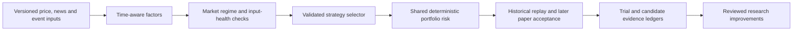

# Factors, complementary feeds and market-state selection

The user wants catalyst/incentive research, historical extreme movers and
automatic strategy adaptation to market conditions. The proposed workflow is:

This is a source-reviewed design. No new feed subscription or strategy-switching
service was activated. The [protocol](research-protocol.json) keeps the strategy
pool empty and thresholds unset until their acceptance criteria and data exist.
“Factor” here means a candidate explanatory/predictive feature, not an established
cause or profitable edge. Mechanism narratives must compete against controls.

## Feed and factor map

| Candidate signal | Proposed source / native API | Evidence and decision |
| --- | --- | --- |
| Trailing momentum, relative volume, spread, volatility, breadth | [Alpaca bars](https://docs.alpaca.markets/us/reference/stockbars) and [stock streams](https://docs.alpaca.markets/us/docs/real-time-stock-pricing-data) | Retain as core research path pending account/feed acquisition acceptance. Preserve feed, adjustments, pagination, received revisions and nanosecond quote/trade timestamps. Current microsecond fixture is not tick ingestion. |
| New catalysts, novelty and sentiment | [Alpaca news REST](https://docs.alpaca.markets/us/reference/news-3) and [WebSocket](https://docs.alpaca.markets/us/docs/streaming-real-time-news) | Plan scoped versioned capture; creation/update times do not establish original receipt or immutable article history. Publisher rights and measured signal quality remain separate. |
| Filings, ownership/funding changes and dilution hypotheses | [SEC submissions and CompanyFacts](https://www.sec.gov/search-filings/edgar-application-programming-interfaces) | Retain the existing SEC lane. CompanyFacts contains standardized facts and cannot represent all filing disclosures. Keep accessions, amendments and source text. Earlier HTTP 403 remains an acquisition failure. |
| Halts, pauses and resumption | [Nasdaq halt RSS](https://www.nasdaqtrader.com/Trader.aspx?id=TradeHaltRSS) | Research secondary status input. Once-minute updates/request limit are too slow for a sole execution safeguard. Keep attribution and [feed terms](https://www.nasdaqtrader.com/content/administrationsupport/agreementstrading/THRSSFeedTermsCond.pdf). |
| Crowding and changing short interest | FINRA Query API `otcMarket/consolidatedShortInterest`, [official documentation](https://developer.finra.org/docs) | Research slow context; use publication availability rather than settlement date. Credentials and [equity-data terms](https://developer.finra.org/specific-terms-equity-data) apply. It is not a realtime squeeze signal. |
| Macro trend, inflation, growth and rates | [FRED/ALFRED observations](https://fred.stlouisfed.org/docs/api/fred/series_observations.html) with [historical real-time periods](https://fred.stlouisfed.org/docs/api/fred/realtime_period.html) | Research vintage-aware context. Default current values leak revisions into history. Vintage dates alone do not prove intraday release/receipt time. Key and [series rights](https://fred.stlouisfed.org/docs/api/terms_of_use.html) require acceptance. |
| Earnings schedule, consensus and surprise | Benzinga `/api/v2.1/calendar/earnings`, [upstream workflow](https://www.benzinga.com/apis/blog/mastering-the-earnings-api-earnings-calendars-and-surprise-detection-with-python/) | Defer licensed acquisition pending schedule/consensus revision provenance and [product rights](https://www.benzinga.com/apis/cloud-product/corporate-earnings/). Keep confirmed status, revision, estimates, results and accounting basis distinct. |

FINRA's September 15, 2026 settlement snapshot is scheduled for September 24
publication, so it is unavailable to a September 19 decision. This illustrates
why a period label must not be used as the knowledge timestamp.
[Publication schedule](https://www.finra.org/filing-reporting/regulatory-filing-systems/short-interest).
Daily short-sale volume also is not outstanding short interest.
[FINRA explanation](https://www.finra.org/rules-guidance/notices/information-notice-051019).

Pre-event incentives may include scheduled disclosures, financing/ownership
changes or a hypothesized supply/demand constraint. Those relationships are
research hypotheses; float, borrow availability and options positioning require
their own timestamped source coverage. News sentiment alone does not establish
causation, early availability or trading capacity. Additional feeds should fill
a measured coverage gap, with licenses and revision behavior checked first.

## Versioned automatic selection contract

Separate operational eligibility—feed freshness, halts, spreads, indicator
readiness and portfolio reconciliation—from inferred regime, such as trend,
volatility, breadth or catalyst strength. A favorable regime cannot override an
operational block.

| State | Behavior |
| --- | --- |
| WARMING | Required history/indicators are incomplete; block new risk. |
| NO_NEW_RISK | Missing/stale data, no accepted strategy fit, insufficient confidence or unreconciled state; retain existing position/order responsibility. |
| HOLD | Keep the valid incumbent; another strategy has not met switching conditions. |
| ACTIVE | Use an accepted strategy or a separately prevalidated allocation under shared risk limits. |

An ordinary transition requires declared confidence, advantage over the
incumbent, separate entry/exit thresholds, persistence over completed
observations and minimum residence/cooldown. Heuristic scores are not calibrated
probabilities. Deterministic tie-breaking and an explicit no-fit outcome are
required. Stale data or risk invalidation blocks new risk immediately even
during cooldown; this does not automatically liquidate existing positions.

Record decision sequence/cutoff, input hashes, source versions, feature completion,
previous/next selection, all rejected candidates and reasons, confidence meaning,
policy hash, portfolio-state version and next evaluation time. Keep daily context
frozen between its declared updates; intraday selection cannot see the eventual close.

LEAN's [warm-up primitives](https://www.quantconnect.com/docs/v2/writing-algorithms/historical-data/warm-up-periods)
still require actual indicator/sample readiness checks. Its
[time consolidators](https://www.quantconnect.com/docs/v2/writing-algorithms/consolidating-data/consolidator-types/time-period-consolidators)
use exchange-time boundaries; explicitly choose the intended completed-bar schedule.

## Portfolio transitions and acceptance

Daily and intraday strategies share one account-level risk and order-state owner.
Predeclare whether a switch waits for flat positions, transfers ownership, or
changes incremental targets. Keep exit responsibility for positions and pending
orders. Reconcile uncertain outcomes before changing targets; prevent duplicate
exposure. Net compatible targets before execution only where the transition
policy permits, then charge every actual or simulated executed leg its fees,
spread, slippage and impact. Flattening and later re-entering retains both
executed legs and their costs even when final net exposure is unchanged.

Evaluate the entire selector and strategy pool together. Inner chronological
development selects features, mappings, thresholds and cooldown; outer frozen
periods measure the complete policy after costs against fixed-strategy and
no-switch controls. Keep related events together and purge overlapping labels.
Historical regime labels inferred with future data cannot steer earlier decisions.
[WalkForward primitives](https://skfolio.org/generated/skfolio.model_selection.WalkForward.html)
do not replace these event/portfolio rules.

Acceptance must show deterministic replay, no post-cutoff information, blocked
stale-data entries, bounded switching, correct ownership transitions and held-out
results after costs. Models may extract proposed catalysts or explain evidence
in bounded research jobs; deterministic code owns feature timing, selection,
numeric risk and order state. New model-generated strategies require a separately
reviewed version and acceptance, never automatic promotion into the active pool.

## Evidence boundary and next implementation

This wave reviewed seven complementary source families against current primary
documentation and existing catalog cards. It performed no credentialed financial
API calls, paid acquisition, historical +200% case download or selector run.
The [native receipts](README.md) prove three independent offline capabilities only.

Next implementation artifacts are a timestamp-preserving catalyst/candidate
contract, complete historical candidate replay, frozen factor/strategy controls,
and selector/portfolio-transition fault cases. Source entitlement and availability
must be resolved before scoring actual market performance. Unattended hosting,
off-host recovery and paper connectivity retain their separate open gates.
