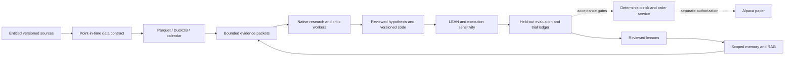

# Architecture convergence and next roles — September 19, 2026

The selected foundation is a **personal research and simulation system**, with
Alpaca paper integration as a subsequent acceptance milestone. Its design uses
models for bounded research and review, and deterministic services for data,
simulation, risk and order state. The [decision index](../../../catalogs/us-equities/decision-index.json)
records the repository union; [research sources](../../../catalogs/us-equities/architecture/README.md)
record what this wave actually examined. A catalog entry is not an installation.

## Ownership

| Role | Responsibility | Artifact / acceptance |
| --- | --- | --- |
| User / product owner | Choose objectives, acceptable risk, capital assumptions, account/data entitlements and operating budget | A numeric research specification and explicit approval for broker-connected progression |
| Coordinator | Select the smallest architecture that meets those requirements; maintain versions, evidence and gates | This blueprint, catalog decisions, immutable experiment and acceptance manifests |
| Research workers | Inspect bounded source packets, propose hypotheses and alternatives, report contradictions | Source-linked proposals; no broker credentials or unrestricted order tools |
| Data worker | Verify availability time, feed, adjustments, universe membership, corporate actions and ingestion completeness | Versioned raw snapshots plus reproducible Parquet/DuckDB transforms and quality reports |
| Strategy / simulation worker | Implement reviewed hypotheses and run reproducible sensitivity and held-out evaluation | Code/data/config hashes, full trial ledger, engine outputs, costs and execution assumptions |
| Independent reviewer | Challenge leakage, multiple testing, execution realism, source quality and unsupported claims | An adjudicated review; model agreement does not prove correctness |
| Operations worker | Reproduce selected environments, observe jobs, rehearse recovery and detect drift | Native receipts, independent restore evidence, failure and alert drills |
| Deterministic execution service (future) | Enforce numeric risk, one writer per account, journal and reconcile orders | Broker-disconnected fault tests, then separately authorized paper acceptance |

Workers are task roles, not a requirement for seven permanent model processes.
The current coordinator dispatches at most three useful independent workers.
Separate writing worktrees and one integrating coordinator remain the practice.

## Selected responsibilities by layer

| Layer | Retain / select | Conditional alternative and acceptance |
| --- | --- | --- |
| Personal coding and research | Native Codex / official SDK, Claude Code; accepted Astra and Opus 5 calls | New releases are discovery candidates until native compatibility and task quality pass. Personal native sign-in does not establish hosted commercial product access. |
| Architectural token efficiency | Deterministic data reduction; stable instructions; small source-linked packets; native caching; one retrieval lane per artifact | Measure complete comparable tasks, quality and usage before claiming net provider savings. No model in tick processing or order retry loops. |
| Context and code navigation | Context Mode, scoped RTK, QMD, exact rg/Serena, selected Repomix/ast-grep | Preserve errors/raw recovery; avoid repeatedly compressing the same artifact. |
| Memory and code RAG | ai-memory; scoped SocratiCode/Qdrant/local Nemotron embedding | Reviewed lessons and retrieval evaluation, with scope/revocation/recovery gates. New embeddings must beat a frozen relevance set before reindexing. |
| Workflow ownership | Dagu for the accepted manual local workflow | DeerFlow 2.0 is optional research composition and already uses LangGraph; Temporal/Restate need a demonstrated durability/scale requirement. No overlapping scheduler ownership. |
| Routing | Native direct clients by default; existing OmniRoute only for explicitly selected routes | Verify provider identity, access terms, request/usage accounting and failure behavior per route. A route is not a substitute for model entitlement. |
| Historical data | Versioned raw inputs, Parquet, DuckDB and an explicit exchange calendar | Alpaca or another entitled point-in-time source; SQLMesh/OpenLineage/Marquez only for demonstrated transformation/lineage needs. Neither format nor lineage alone proves time correctness. |
| Research and simulation | Accepted LEAN baseline; deterministic experiment ledger | NautilusTrader, HftBacktest, vectorbt, backtesting.py, Qlib and other challengers have distinct roles and limitations in the trading review. No wholesale engine swap is justified by popularity. |
| Portfolio/statistics | Explicit constraints and dependence-aware validation; selected reports | Evaluate skfolio/QuantStats where they add a required calculation. Reports and a bootstrap function do not validate a strategy by themselves. |
| Alpaca boundary | Current alpaca-py for observed basic SDK compatibility; future reviewed adapter | Elite DMA/VWAP/TWAP serialization is **not accepted**. LEAN adapter initialization/entitlement and actual account support remain separate. |
| Observability and recovery | Native OTel Collector, Prometheus, Loki; gitleaks, Syft and Restic | Off-host backup/key recovery, external alerts and unattended failover remain gates. Add governance services only when their operational value exceeds their cost. |



This is the selected boundary, not a claim that the future execution service or
all arrows are implemented. Dagu currently hosts manual local research runs.

## Alpaca constraints that change the design

The [Elite page](https://alpaca.markets/elite) advertises **1,000 API requests per
minute**, not 1,000 executed trades per minute. Treat trading requests as an
account-level budget that includes order management and reconciliation. Reserve
capacity for cancels/risk/recovery and back off on actual account responses;
never translate the published ceiling into a strategy target. Actual account
limits and Elite eligibility have not been observed here.

The [technical market-data documentation](https://docs.alpaca.markets/us/docs/about-market-data-api)
separately lists Basic 200 versus Algo Trader Plus 10,000 historical requests per
minute, US-equity history since 2016, and feed/subscription restrictions. The
marketing phrase “unlimited” does not establish infinite history, unlimited
throughput, every feed, or redistribution rights. Trading API and the partner
Broker API are distinct products. Use streams for current data and versioned,
paginated downloads for research; record feed, adjustment policy and entitlement.

The [Smart Router documentation](https://docs.alpaca.markets/us/docs/alpaca-elite-smart-router)
describes advanced routing through `advanced_instructions`. Our installed
`alpaca-py==0.44.0` silently omitted that field in an **offline serialization
probe**. [The actual result](alpaca-probe.json) records three synthetic sentinel
cases and exit code 2: zero clients, network requests or orders. These are not
valid-order or wire-contract fixtures. Advanced execution stays unaccepted until
a reviewed adapter preserves exact intended fields, rejects unknown fields,
passes replacement/cancellation/reconciliation contracts and is confirmed against
the entitled provider environment. Do not bypass the finding with an unreviewed
raw REST call.

[Paper trading](https://docs.alpaca.markets/us/docs/paper-trading) omits important
execution effects, including impact, queue/latency behavior and several cash-flow
or fee effects. A paper-only account has IEX entitlement; do not infer the feed of
an arbitrary funded/paper account without checking it. Simulation and paper
success therefore cannot establish future live performance.

The official organization scan found 94 public repositories, including 29
archived and 37 forks (categories overlap). Official ownership is useful
provenance, not a universal adoption recommendation. `alpaca-trade-api-python`
is archived; use the maintained Python SDK. `example-hftish` has a 2019 source
head and is a historical example. The maintained C#, Go and JavaScript SDKs are
language alternatives. The current official MCP server is a v2 rewrite with
changed tools; it is not automatically granted broker access in research workers.

## Promotion contract

1. **Research specification:** propose an explicit universe, holding horizon,
   data/feed, strategy class and numeric risk/capacity assumptions. User choices
   about capital and acceptable risk remain required before broker progression.
   Provisional research specifications may be drafted and labeled; missing values
   must never silently become live defaults.
2. **Data acceptance:** immutable raw identity/hash, event and available-at time,
   entitlement, corporate actions, delistings, universe history, pagination and
   adjustment policy. Retain missing/stale data and failed ingestion evidence.
3. **Simulation acceptance:** chronological held-out/walk-forward evaluation,
   leakage checks, dependence-aware uncertainty, all attempted variants, and
   costs/capacity/latency/fill sensitivity. LEAN's default full fills and a price
   slippage model do not prove quantity/depth realism.
4. **Offline execution acceptance:** duplicate intent, ambiguous timeout,
   restart, partial fills, stale data, numeric limit breaches, rate exhaustion,
   reconciliation, cancellation and kill-switch tests. A stable client ID alone
   does not make retries safe; query/reconcile uncertain outcomes first.
5. **Paper acceptance:** separately authorized account/feed and adapter, long
   enough operational observation for the selected strategy, ledger reconciliation
   and recovery/alert drills. Predeclare numeric criteria; do not invent a generic
   fixed duration or profitability threshold.
6. **Future live decision:** separate user authorization, actual account/risk and
   operating readiness. No automatic promotion from memory, model agreement,
   backtest ranking or a paper result.

Compounding learning records rejected hypotheses, data defects, retrieval
feedback, model-review corrections and reproducible experiments. Keep durable
facts reviewable and shared across Codex/Claude. Upstream ai-memory offers
`[auto_improve] require_approval = true` and
`[auto_improve.scheduler] enabled = false`; this wave does not claim to enable or
change that pipeline. Trading policy promotion is always a separate controlled
decision.

## Platforms and hosting

| Target | Current evidence | Next acceptance |
| --- | --- | --- |
| Linux / WSL2 x86_64 | Native installed components, fresh hash-locked SDK recreation, paired research and local observation passed | Selected job interruption/resource limits, unattended operation and off-host recovery |
| macOS Apple Silicon | Source-reviewed installation/platform recipes | Native login, hooks/tools, worker/data/backtest and observation receipts on the actual Mac; test MLX/Metal separately from CUDA serving |
| Always-on Linux host | Proposed operating destination, not deployed | Host/account/budget choice, service supervision, least-privilege credentials, restart behavior, external alerts and independent recovery |

Clone and follow [portable adoption](../../../adoption/README.md); authenticate
each native client on the destination. Recreate the selected profile from pins
and acceptance commands. Do not copy login stores or infer live activation from
a presence check. A personal laptop/WSL session is not an accepted always-on
execution host. No cloud resources were purchased or deployed in this wave.

## Native evidence and continuation

The [native review receipt](receipt.json) preserves this wave's Astra and Claude
results, usage and limitations. [Review adjudication](review-adjudication.md)
records supported suggestions and model overstatements. The offline SDK probe is
reproducible with the accepted SDK environment:

```sh
"$SDK_PYTHON" blueprints/us-equities/architecture/alpaca_capabilities.py
# Observed exit 2: advanced instructions dropped in all three sentinel cases.
gh api --paginate 'orgs/alpacahq/repos?per_page=100&type=public'
python3 scripts/catalog_decisions.py --check
python3 scripts/validate_catalogs.py
```

For each future wave: refresh identities and releases; inspect only candidates
that address a stated gap; compare license, API/source behavior, upstream checks,
maintenance and reproducibility; run native acceptance only for a justified
promotion. Preserve rejected candidates and errors. Update the typed index,
hashed evidence and [open gates](../../../catalogs/us-equities/convergence-review.json)
together. A wave converges when remaining candidates add no demonstrated value
to the selected responsibilities—not when the Internet has been exhausted.
