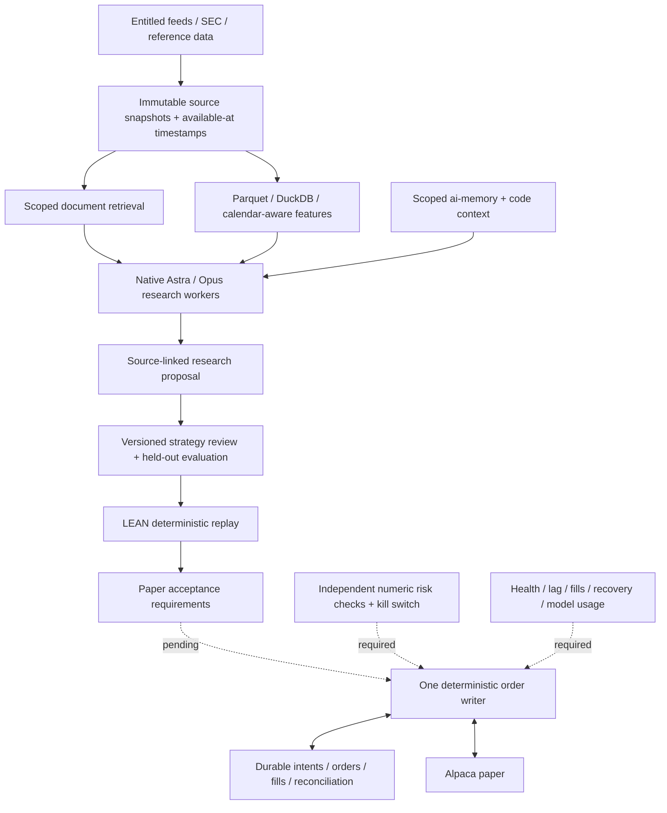

# North star: evidence-led US-equities automation

The target is a system that moves from reproducible research to an observable,
recoverable **Alpaca paper** runtime. The present deliverable is its native
research/backtest foundation and examined [grand catalog](../../catalogs/us-equities/README.md).
It is not a deployed broker service or a validated profitable strategy.

## A coherent default

| Responsibility | Selected path | Adoption status |
| --- | --- | --- |
| Research workers | Native Codex SDK / GPT-6 Astra; existing Claude Opus companion | Astra SDK inference proved; Claude has earlier native receipts |
| Context efficiency | Stable policy, bounded tool output, Context Mode/RTK, explicit handoff files | Native use proved with documented scope limits |
| Continuity | ai-memory as shared durable memory; canonical project instructions for rules | Active in the adopted starter project |
| Retrieval | QMD for scoped Markdown; Serena for symbols; SocratiCode → Nemotron → Qdrant for code | Local automatic code refresh proved; no financial corpus implied |
| Optional routing | OmniRoute for deliberately selected, independently verified routes | Healthy; prior Opus/Qwen and new bounded Astra text proof; full native parity unproved |
| Optional research orchestration | DeerFlow stable 2.0 reference; pinned development backend/ACP exploration | Embedded native ACP inference proved; full planner/UI hosting pending |
| Market/filing ingestion | Alpaca SDK plus SEC-sourced filings; alternative commercial feeds only with entitlement | SDK installed; financial ingestion and account access pending |
| Research data | Immutable raw snapshots, Parquet and DuckDB; exchange calendars | Native sample-event pipeline proved |
| Engine | LEAN native source build, one engine-owned paper adapter later | Bundled backtest proved; patched build and source-integrated adapter evidence recorded; credentialed runtime pending |
| Strategy research | Simple lagged baselines, then selected Qlib/statistical/portfolio tools | Catalogued; no strategy accepted or performance asserted |
| Execution state | Separate deterministic order writer, durable journal and broker reconciliation | Design requirement, not implemented |
| Hosting | On-demand native research and Dagu history service now; dedicated identity for paper later | No new cloud account or standing trading service |
| Operations | Private receipts/usage, Gitleaks now; SBOM, dependency triage, telemetry and recovery later | Scope-specific evidence in the catalog |

Installing every alternative would increase dependency, model-call and context
cost. A new component should close a named requirement or beat the current path
on a held-out task with comparable quality, latency and total usage.

## Research harness contract

Use [research-task.md](workers/research-task.md) with the existing native worker.
Its shared [policy](workers/policy.md) applies to every worker launched by that
example. A worker receives a bounded objective, selected source/artifact paths,
an as-of cutoff and a required result. It returns evidence and proposals, never
an executable broker instruction. The [contract JSON](harness-contract.json)
records which boundaries are actually implemented and which remain requirements.

Give each writer its own worktree and a bounded file set. One coordinator
integrates. Independent research workers can examine data, engines and operations
in parallel; they should share artifact references rather than full conversation
copies. Stop dispatch on a fresh quota failure, preserve failed-attempt usage and
do not silently choose a different model.

Before starting a worker, inspect its native tool catalog and scoped project
identity. Filesystem read-only mode does not make inherited MCP tools read-only.
The SDK environment overlay does not remove parent secrets. The research process
must have no broker credentials; that separation must be enforced by its host
identity/tool configuration before unattended use. Current policy text alone
does not enforce all these deployment boundaries.

## Data and strategy acceptance

Store the vendor, entitlement, source URI, content hash, symbol identifier,
event time, first available time, ingestion time, adjustment convention and
revision with each dataset. Historical SEC acceptance timestamps, current
constituents or revised macro values are not automatically the information a
strategy could have used at the time. Filing evidence must retain units, fiscal
periods, amendment relationships and citations. See the [data catalog](../../catalogs/us-equities/data-research.md).

Begin with a fixed universe, holding period and delayed-data assumptions. Record
all attempted variants. Use chronological holdouts and walk-forward evaluation;
where labels overlap, separate training/evaluation intervals appropriately.
Include delistings, corporate actions, realistic spread/fees/slippage, turnover,
position limits and capacity assumptions. Compare strategy behavior with simple
benchmarks and a no-trade case. LLM sentiment, RL rewards, forecast error and a
backtest Sharpe alone do not demonstrate deployable alpha. See the
[strategy/engine catalog](../../catalogs/us-equities/engines-strategies.md).

The completed LEAN sample proves an engine/data path: 3,943 data points and three
simulated orders. Its 2013 sample is not a contemporary strategy evaluation.
The original build's seven advisory/package pairs were resolved in the
[pinned local patch](engine/resolution.md); standing trading deployment still needs
broker, risk and recovery acceptance. Do not interpret a successful build as dependency security acceptance.

## Paper runtime acceptance

The future paper service needs explicit numeric limits, an allowed universe,
session/extended-hours policy and data-feed entitlement. Maintain one order writer
per account/strategy scope. Persist intent and a stable client order ID before
submission, then query/reconcile after ambiguous responses instead of blindly
retrying. Reconcile streaming events against broker snapshots on reconnect and
startup; account for partial fills, replacements, cancellations and reserved
buying power. These are design requirements derived from the broker's
[order lifecycle](https://docs.alpaca.markets/us/docs/orders-at-alpaca), not a
claimed implementation in this repository.

Reject stale/missing prices, invalid quantities and exposure breaches before an
order reaches the adapter. Keep kill-switch and recovery behavior independent of
LLM availability. Exercise disconnect, timeout, duplicate-intent and restart
scenarios in paper mode before considering unattended operation. Paper fills do
not model all live execution effects; the upstream [paper-trading documentation](https://docs.alpaca.markets/us/docs/paper-trading)
defines that boundary. No live-trading deployment is authorized by this blueprint.

## Hosting progression

Keep research on demand until a repeatable strategy/data workflow exists. Move
paper execution to a dedicated Linux identity with persistent storage, service
restart supervision, secret ownership, backups and observable health. Choose
Temporal only for a concrete durable workflow need, and containers/microVMs for
a concrete isolation requirement. A managed GPU provider is optional for model
experiments, not a prerequisite for the broker process. No paid host is enabled.

The [hosting guide](hosting.md) and [operations catalog](../../catalogs/us-equities/agents-operations.md)
compare these options. Useful operational signals include feed age, missing bars,
clock skew, reconciliation drift, rejected/duplicate orders, fill latency,
exposure, disk/database health, worker latency and complete token usage. Scrub
credentials and private financial records before exporting traces.

## Token-saving acceptance

Apply the same practice to every runtime worker: inspect once, retrieve focused
evidence, compute raw-data aggregates in SQL/code, reuse a stable policy prefix,
return compact artifacts and keep native compaction/cache behavior. Do not put
tick streams, whole repositories or entire session archives into each prompt.

For an exact savings claim, run the same task and fixed inputs through baseline
and candidate paths, preserve comparable answer quality and count all calls,
cache writes/reads, reasoning/output and failures. Report wall time and any local
model resource cost separately. Current exact evidence is the selected public
artifact reduction **2,730 → 491 tokens (82.01%)**. Native SDK cache reuse is a
different measurement: **176,000 cached out of 202,164 input tokens** across three
turns. Neither proves an 82% or 87% reduction in whole-task provider consumption.
