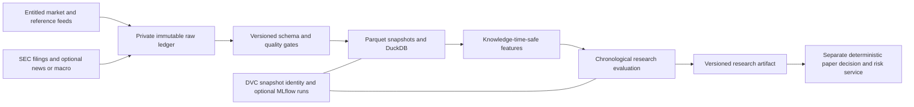

# US-equities data and research catalog

Checked **2026-09-19**. This is a curated, source-reviewed selection of **36 repositories**, including recent starred projects and additional infrastructure candidates. It is a decision catalog, not a claim that every repository is installed, that the collection is globally exhaustive, or that a profitable trading system has been demonstrated.

The machine-readable [catalog](data-research.json) records each repository's reviewed release and full source commit, software license, adoption decision, US-equity and Alpaca fit, prerequisites, limitations, primary sources and native command examples. `default` means recommended for the initial design; `conditional` requires a specific need; `alternative` replaces a comparable choice; `watch` needs further resolution; `excluded` is unsuitable for the authoritative data plane. These are engineering recommendations, not investment recommendations.

**Evidence boundary:** DuckDB and exchange_calendars have narrowly scoped native receipts. The other 34 entries are `source_review`. The original catalog review performed no new runtime or provider acceptance; later executions are linked explicitly below. Prospective commands remain unexecuted unless a named receipt records their bounded execution. Commands use upstream executables/SDKs with explicit inputs; they are not claimed to be verbatim upstream tutorials or completed trading workflows. The individual current versions are not a jointly resolved dependency lockfile.

The [research-runtime receipt](../../blueprints/us-equities/research-runtime/receipt.json) adds a fresh bundled LEAN simulation, successful Dagu packet/Parquet preparation and a **standalone Claude Opus 5** cited report. The paired Astra-to-Claude graph remained allowance-blocked. This did not turn the simulation into SEC-based research or broker evidence. The [SEC recipe](../../blueprints/us-equities/financial-data/README.md) passed offline adversarial temporal/decimal tests, while its first official acquisition request returned **HTTP 403**: no live SEC dataset or ready source packet exists from that attempt. Synthetic fixture success is kept separate from acquisition success.

## A coherent local-first data plane

Start with **Alpaca's official SDK**, **EdgarTools** where filing research is needed, **immutable raw objects and Parquet**, **DuckDB**, **exchange_calendars**, **Pandera** contracts and **DVC** snapshot metadata. Separate credentials and permitted raw data from this public repository. The existing [native data receipt](../../blueprints/us-equities/data/receipt.json) gives DuckDB/calendar adoption a concrete starting point; it does not prove any of the proposed ingestion or quality gates.



A research worker may propose a hypothesis, extract a cited filing fact or produce a reviewed research artifact. It should not silently change dataset cutoffs, rewrite raw history, select a different feed or obtain order credentials. The broker service remains responsible for deterministic validation, limits, paper routing, idempotency and reconciliation. Data infrastructure and LLM interfaces do not supply those controls.

Add tools when an observed need justifies them:

| Need | Preferred lane | Decision boundary |
|---|---|---|
| Broker-native basic data | Alpaca-py | Confirm actual feed/history permissions; specify feed explicitly. |
| Deeper licensed exchange replay/reference | Databento **or** Massive | Compare required venues, delisted history, corporate actions, latency, contract and cost. Neither SDK grants data rights. |
| Filing originals only | sec-edgar-downloader instead of a full parser | Preserve originals; parsing and availability checks remain separate. |
| Complex dataframe transforms | Polars alongside selected SQL stages | Avoid duplicate implementations of the same complete pipeline. |
| Cross-engine typed interchange | Arrow | Useful when required; DuckDB's basic Parquet path does not require PyArrow. |
| Multiple independent live consumers | Kafka **or** Redpanda | Explicit retention, replay, sequence, checkpoint and failure ownership before deployment. |
| Continuous shared tick analytics | QuestDB **or** ClickHouse | Measure needs first; neither substitutes for immutable raw capture. |
| Repeatable incremental loaders | dlt | Schema inference and watermarks need correction-aware contracts. |
| Multi-team lake branching | lakeFS instead of only local DVC snapshots | Adds service and storage operations; DVC and lakeFS solve different scopes. |
| Multi-engine transactional tables | Iceberg **or** delta-rs | Choose a table protocol and retention policy; do not install both without a consumer requirement. |
| Versioned dataframe workloads | ArcticDB | Resolve current deployment/license terms before adoption. |
| Experiment comparisons | MLflow | Link exact data/code/split identities; a tracking run is not model validation. |
| Shared feature serving | Feast | Event-time joins still need knowledge-time/revision controls. |
| Team lineage or validation reporting | OpenLineage or Great Expectations | Add to satisfy a concrete integration/reporting need. |
| Research interfaces | OpenBB; watch Fincept Terminal | Provider rights, licensing and execution boundaries remain separate. |

## Data sources, reference data and research interfaces

| Repository | Checked release/package | Decision | Main constraint |
|---|---|---|---|
| [Alpaca-py](https://github.com/alpacahq/alpaca-py) | 0.44.0 | Default | Feed/history entitlement and symbol/adjustment semantics. |
| [Databento Python](https://github.com/databento/databento-python) | 0.86.0 | Conditional | Exchange/reference products and redistribution contract. |
| [Massive Python](https://github.com/massive-com/client-python) | 2.8.0 | Conditional | Current Polygon successor; split adjustment is not total return. |
| [EdgarTools](https://github.com/dgunning/edgartools) | 5.58.0 | Default | Original accession, fact revision and observed availability. |
| [sec-edgar-downloader](https://github.com/jadchaar/sec-edgar-downloader) | 5.1.0 | Alternative | Raw download is not parsed or point-in-time fundamentals. |
| [OpenBB](https://github.com/OpenBB-finance/OpenBB) | Python 4.7.2; separate source pin | Alternative | AGPL/commercial terms and each provider's rights. |
| [yfinance](https://github.com/ranaroussi/yfinance) | 1.7.0 | Excluded from authoritative plane | Unofficial access and upstream personal-use data limitation. |
| [GDELT DOC client](https://github.com/alex9smith/gdelt-doc-api) | 1.12.0 | Conditional | Community wrapper; bounded queries and publisher rights. |
| [fredapi](https://github.com/mortada/fredapi) | 0.5.2 | Conditional | Macro vintages and per-series rights; community wrapper. |
| [Fincept Terminal](https://github.com/Fincept-Corporation/FinceptTerminal) | 4.5.0 | Watch | Nonstandard licensing; optional research UI, no execution authority. |

**Alpaca:** free Basic live stock coverage is IEX, which is not the consolidated SIP. The official FAQ permits some historical SIP queries without a paid live SIP subscription when the query ends sufficiently far in the past; do not describe all SIP history as paid-only. Set feed, interval, timezone, adjustment and symbol `asof` explicitly and record the result's provenance. Symbol `asof` is not a universal “what was known then” switch. These are distinct API semantics, and the account's actual permissions were not queried. [Plan coverage](https://docs.alpaca.markets/us/docs/about-market-data-api), [historical-feed FAQ](https://docs.alpaca.markets/us/docs/market-data-faq), [pinned request fields](https://github.com/alpacahq/alpaca-py/blob/v0.44.0/alpaca/data/requests.py).

**Databento and Massive:** select a product against an explicit dataset specification. Databento distinguishes market-event times and reference updates; its corporate-action records use UTC record timestamps and exchange-local action dates. Massive has dated/inactive ticker queries, but their existence does not certify a complete investable universe. Its stock aggregates can be split-adjusted while remaining unadjusted for dividends. Preserve raw prices and separately version the chosen adjustment factors. [Databento corporate-action schema](https://databento.com/docs/schemas-and-data-formats/corporate-actions), [Massive stock overview](https://massive.com/docs/rest/stocks/overview), [Massive adjustment policy](https://massive.com/knowledge-base/article/is-massives-stock-data-adjusted-for-splits-or-dividends).

**SEC:** filings are publicly available without a purchased API subscription, with identifying requests and SEC fair-access limits. Neither a filing period nor an acceptance timestamp alone proves when the information reached a researcher. Keep original documents and accession IDs, and distinguish acceptance, dissemination/first observation and retrieval timestamps. A company-facts query made today may include later amendments. [SEC access policy](https://www.sec.gov/search-filings/edgar-search-assistance/accessing-edgar-data), [SEC API description](https://www.sec.gov/search-filings/edgar-application-programming-interfaces), [public-availability timing](https://www.sec.gov/about/webmaster-frequently-asked-questions).

**News and macro:** the GDELT wrapper is useful for discovery and coverage research, not a complete historical financial-news archive. Retain publication time, first observation, deduplication and issuer-mapping provenance. ALFRED vintages help separate original macro releases from revisions, but a vintage date is not an exact intraday announcement timestamp. Neither service conveys all underlying publishers' redistribution rights. [GDELT DOC API](https://blog.gdeltproject.org/gdelt-doc-2-0-api-debuts/), [FRED real-time periods](https://fred.stlouisfed.org/docs/api/fred/realtime_period.html), [FRED terms](https://fred.stlouisfed.org/docs/api/terms_of_use.html).

## Storage, computation, lineage and quality

| Repository | Checked release/package | Decision | Scope |
|---|---|---|---|
| [DuckDB](https://github.com/duckdb/duckdb) | 1.5.5 | Default; native evidence | Local SQL/Parquet. |
| [Polars](https://github.com/pola-rs/polars) | Python 1.44.2 | Alternative | Lazy dataframe transformations. |
| [Arrow](https://github.com/apache/arrow) | 25.0.1 | Conditional | Typed interchange and Parquet IO. |
| [ArcticDB](https://github.com/man-group/ArcticDB) | 6.26.0 | Conditional | Versioned dataframes; licensing needs resolution. |
| [QuestDB](https://github.com/questdb/questdb) | Server 10.0.1 | Conditional | Streaming time-series SQL. |
| [ClickHouse](https://github.com/ClickHouse/ClickHouse) | 26.8.7.19 LTS | Conditional | Shared columnar analytics. |
| [Kafka](https://github.com/apache/kafka) | 4.3.1 | Conditional | Durable partitioned log. |
| [Redpanda](https://github.com/redpanda-data/redpanda) | 26.2.2 | Alternative | Kafka-compatible log; BSL/RCL terms. |
| [dlt](https://github.com/dlt-hub/dlt) | 1.30.0 | Conditional | Incremental ingestion/loading. |
| [DVC](https://github.com/treeverse/dvc) | 3.67.1 | Default | Private artifacts linked to Git metadata. |
| [lakeFS](https://github.com/treeverse/lakeFS) | Server 1.86.0; Python 0.16.0 | Alternative | Object-storage branches/snapshots. |
| [MLflow](https://github.com/mlflow/mlflow) | 3.16.1 | Conditional | Experiment metadata/artifacts. |
| [OpenLineage](https://github.com/OpenLineage/OpenLineage) | 1.53.0 | Conditional | Job/run/dataset lineage events. |
| [Iceberg](https://github.com/apache/iceberg) | 1.11.0; PyIceberg 0.12.0 | Conditional | Table snapshots and evolution. |
| [delta-rs](https://github.com/delta-io/delta-rs) | Python 1.6.4 | Alternative | Local Delta tables without Spark. |
| [Feast](https://github.com/feast-dev/feast) | 0.66.0 | Conditional | Historical/online feature definitions. |
| [Pandera](https://github.com/unionai-oss/pandera) | 0.33.1 | Default | Explicit dataframe contracts. |
| [Great Expectations](https://github.com/fivetran/great_expectations) | 1.23.1 | Alternative | Validation suites and reporting. |
| [exchange_calendars](https://github.com/gerrymanoim/exchange_calendars) | 4.13.2 | Default; native evidence | Versioned exchange sessions. |
| [pandas_market_calendars](https://github.com/rsheftel/pandas_market_calendars) | 5.4.0 | Alternative | Pandas schedules/interruptions. |

The proposed data contract is more important than adding another database. These are **requirements for future implementation**, not claims that this repository has already enforced them:

1. **Instrument and universe identity.** Use stable security/share-class identifiers plus effective-dated and knowledge-dated ticker/exchange/issuer mappings. Keep delisted securities and historical membership. CIK identifies an issuer; it is not a unique tradable security. Record universe-selection rules and the exact membership snapshot.
2. **Two temporal meanings.** Store event/effective time and first-known/received time separately, in addition to source publication and ingestion times where available. A feature available to a decision must have a justified knowledge timestamp no later than that decision. A current correction to an old period must not enter an earlier training fold. If only daily availability is known, record that uncertainty rather than inventing intraday precision.
3. **Immutable revisions and adjustments.** Retain raw records, cancellations and corrections with source identity/sequence, original hashes and acquisition metadata. Build curated “latest” tables as derived views. Keep raw, split-adjusted and total-return series distinct; version factor inputs and their availability. Do not price historical executions from a silently adjusted signal series.
4. **Sessions, units and precision.** Store UTC instants and explicit exchange-local session labels, currency, timestamp units and exact price/quantity representations. Distinguish regular and extended hours, daylight-saving transitions, early closes and security-specific halts. A shipped calendar is not a live halt/status feed.
5. **Promotion and replay.** Define duplicate/revision keys, missingness, monotonicity, precision, OHLC relationships and feed-specific exception rules. Quarantine failures before snapshot promotion. Pin schema, raw and curated hashes, source request parameters, code/dependency versions, calendar, universe, adjustment mode and knowledge cutoff. Retain every required version across garbage collection.
6. **Access and cost.** Keep a dataset entitlement record: provider/product, permitted users/purpose, professional classification, venue/depth/latency, history, limits, retention and redistribution/derived-data rights. Store credentials outside Git. Software license and data rights are separate; provider usage charges and LLM token usage are also separate counters.

DuckDB/Polars backward ASOF joins and Feast's historical retrieval are useful primitives. They do not independently establish the knowledge-time contract above. Filter to admissible record versions before joining, use stable entity keys, bound staleness and record the chosen revision. DVC/lakehouse hashes and MLflow runs establish reproducible identities only after that contract is implemented. [DuckDB ASOF](https://duckdb.org/docs/current/guides/sql_features/asof_join), [Polars ASOF requirements](https://docs.pola.rs/api/python/stable/reference/lazyframe/api/polars.LazyFrame.join_asof.html), [Feast point-in-time joins](https://docs.feast.dev/getting-started/concepts/point-in-time-joins), [DVC workflow](https://doc.dvc.org/start).

## Research and evaluation choices

| Repository | Checked release | Decision | Appropriate role |
|---|---|---|---|
| [sktime](https://github.com/sktime/sktime) | 1.1.0 | Conditional | Temporal split/evaluation interface and baselines. |
| [StatsForecast](https://github.com/Nixtla/statsforecast) | 2.1.1 | Conditional | Inexpensive statistical baselines. |
| [MLForecast](https://github.com/Nixtla/mlforecast) | 1.1.0 | Alternative | Transparent lag-based ML models. |
| [tsfresh](https://github.com/blue-yonder/tsfresh) | 0.21.2 | Conditional | Bounded past-window feature extraction. |
| [River](https://github.com/online-ml/river) | 0.26.1 | Conditional | Predict-before-learn evaluation with realistic label delays. |
| [Qlib](https://github.com/microsoft/qlib) | 0.9.7 | Watch | Financial-ML research comparison after US-data preparation. |

Start with declared chronological folds and simple baselines. Fit preprocessing, imputation and feature selection inside each training fold. Where labels overlap future horizons, separate/purge those overlaps and document any embargo. Reserve an untouched final period, log the number of attempted variants, and evaluate realistic costs and execution constraints separately. Dataset freshness or a newer model release does not establish better out-of-sample performance. The tiny synthetic/native examples in the JSON are API demonstrations, not trading research results. [sktime temporal evaluation](https://www.sktime.net/en/stable/api_reference/auto_generated/sktime.forecasting.model_evaluation.evaluate.html), [StatsForecast rolling validation](https://nixtlaverse.nixtla.io/statsforecast/docs/tutorials/crossvalidation.html), [River delayed progressive validation](https://riverml.xyz/latest/api/evaluate/progressive-val-score/).

Qlib's reviewed release documentation says its official example dataset is temporarily disabled and suggests a community substitute. Its commonly shown Yahoo/China examples are not an entitlement, US-universe guarantee or ready replacement for the selected broker engine. The catalog intentionally leaves dataset downloads and model experiments unexecuted. [Pinned Qlib data preparation](https://github.com/microsoft/qlib/blob/v0.9.7/README.md#data-preparation).

## Licensing and current-version qualifications

Permissive SDK licenses do not grant data access. Preserve contractual restrictions even after copying data into Parquet, a vector index, features or a report; do not assume derived data is freely redistributable. Massive's market-data terms, Databento's corporate-action product terms, SEC fair-access rules, publisher rights and FRED source-series terms apply at different boundaries. No subscription was purchased or provider capability inferred from a successful package metadata lookup. [Massive terms](https://massive.com/terms/market_data_terms.pdf), [Databento corporate actions](https://databento.com/corporate-actions).

OpenBB uses AGPL with a commercial option. Current ArcticDB is BSL source-available; its pinned Additional Use Grant and current vendor business-use prose should be reconciled for the intended deployment before use. Redpanda combines BSL core and separately licensed enterprise features. Fincept's pinned license includes AGPL wording plus additional commercial/internal-use restrictions, and GitHub reports no standard SPDX license. Treat these accurately as separate licensing decisions, not ordinary unrestricted permissive dependencies. This catalog records the text and uncertainty; it does not resolve conflicting license language. [OpenBB licensing](https://docs.openbb.co/odp/python/faqs/license), [ArcticDB pinned license](https://github.com/man-group/ArcticDB/blob/v6.26.0/LICENSE.txt), [ArcticDB FAQ](https://arcticdb.io/faqs/), [Redpanda licensing](https://github.com/redpanda-data/redpanda/blob/v26.2.2/licenses/README.md), [Fincept pinned license](https://github.com/Fincept-Corporation/FinceptTerminal/blob/v4.5.0/LICENSE).

Version metadata was checked against source tags/commits, repository releases and, where relevant, official package records. Some traps matter:

- Polygon's maintained Python SDK is now **massive-com/client-python** / `massive`. [Official rename](https://www.massive.com/blog/polygon-is-now-massive).
- DVC, Great Expectations and Pandera resolve to the canonical owners shown in this catalog; older links redirect. Their pinned source URLs avoid ambiguity.
- Kafka has no useful GitHub latest-release record; Apache's supported-download page identifies **4.3.1**, released **2026-06-25**. [Apache downloads](https://kafka.apache.org/community/downloads/).
- OpenBB's `ODP` GitHub release is not the Python package version. Server releases for lakeFS, QuestDB and Iceberg are not their Python-client versions.
- `deltalake` **1.6.4** and `pandas_market_calendars` **5.4.0** have newer package/source tags than their GitHub latest-release pointers. JSON sources retain both evidence and the exact reviewed pin.
- Qlib, GDELT's community client and fredapi have older latest checked releases. Useful stable libraries do not need a fabricated “last few weeks” release date. Model selection belongs in the separate model/runtime catalog.
- Fincept 4.5.0's reviewed source describes a C++20/Qt6 desktop with embedded Python; older Electron/Tauri setup assumptions are inappropriate. Its README download table still points at 4.4.1 artifacts, so this catalog provides source inspection rather than asserting a matching binary installation.

## Direct native evidence already present

The existing [receipt](../../blueprints/us-equities/data/receipt.json), [conversion source](../../blueprints/us-equities/data/summarize_backtest.py) and [pinned requirements](../../blueprints/us-equities/workers/requirements.txt) support this bounded result:

```json
{
  "scope": "LEAN bundled historical simulation, not broker fills",
  "events": 6,
  "distinct_orders": 3,
  "statuses": {"filled": 3, "submitted": 3},
  "calendar": "XNYS",
  "sample_session": "2013-10-07",
  "session_open_utc": "2013-10-07T13:30:00+00:00",
  "session_close_utc": "2013-10-07T20:00:00+00:00"
}
```

That receipt supports the two `native_proven` labels only. It supplies neither an entitled live feed, a point-in-time financial dataset, a profitable strategy nor measured token savings. The catalog adds no token-saving measurement and does not change Desktop MCP loading, login state or future-session activation. Any later adoption should replace prospective status with a sanitized receipt that states the exact command, reviewed input identity, direct result, cost/usage source and remaining limits.
