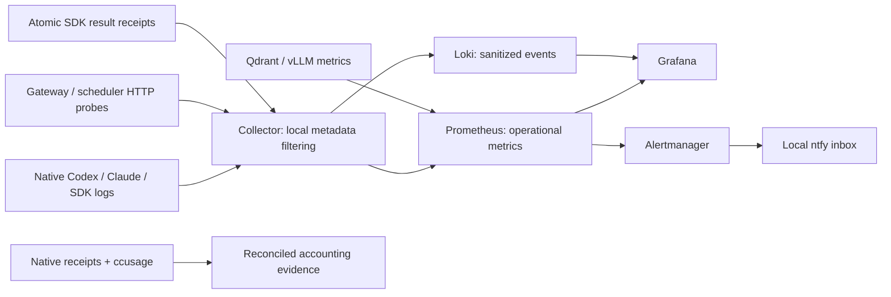
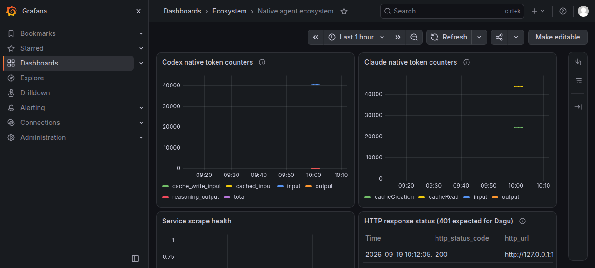

# Native agent observability

**New research acceptance:** [Native runtime receipt](../blueprints/us-equities/research-runtime/receipt.json)
reconciles a real Claude Opus 5 report across its result, Prometheus and Loki:
**14,583 tokens**. One matching process instance exported 51 filtered Loki events;
six services and seven scrape targets were healthy. See [commands and exact scope](../blueprints/us-equities/research-runtime/README.md).

**Latest:** [Desktop restart acceptance](desktop-restart.md) confirms 11 direct
Context Mode tools, 155 exact-task Loki records and 14 successful Context Mode
tool results. Six services are active. Its saved Context Mode counter reports
0 tokens saved; parent turn totals remain unestablished.

The [earlier current-session follow-up](session-e2e.md) resolved native SDK
metrics with the supported App Server setting and one real Context Mode task:
**40,518 tokens**, matching native histogram and automatic receipt. It also adds
WSL host resources and selected range receipt views. The original acceptance
results below remain a dated checkpoint.

This local profile connects native Codex and Claude telemetry to an OpenTelemetry
Collector, Prometheus, Loki, Grafana, Alertmanager and ntfy. The September 19, 2026
acceptance includes actual native client tasks, a native Astra SDK worker,
retained storage, a rendered dashboard, and both firing and resolved local
notifications. [Machine-readable evidence](receipt.json) records the exact scope.

| Layer | Adopted native repositories | Evidence boundary |
|---|---|---|
| Native execution | openai/codex; anthropics/claude-code; official Codex SDK | Existing native subscriptions and model choices; no API-account migration |
| Context and accounting | mksglu/context-mode; rtk-ai/rtk; ccusage/ccusage | Context/output estimates separate from native usage; scoped retrieval rather than full-log ingestion |
| Memory and retrieval | akitaonrails/ai-memory; SocratiCode; qdrant/qdrant; vllm-project/vllm; QMD | Prior memory/RAG acceptance plus current service metrics; no new universal memory index |
| Collection | open-telemetry/opentelemetry-collector-contrib 0.161.0 | One Collector process using core/contrib components; selected private correlation IDs retained |
| Storage and viewing | prometheus/prometheus 3.14.0; grafana/loki 3.7.8; grafana/grafana 13.2.2 | Native queries, dashboard, bounded retention and restart acceptance |
| Alert delivery | prometheus/alertmanager 0.34.1; binwiederhier/ntfy 2.28.0 | Native webhook and bundled ntfy template; local inbox only |
| Workflow/research | Dagu; DeerFlow; native Astra SDK; LEAN | Existing execution receipts plus local service observation; no connected broker |

See the [453-repository landscape index](../catalogs/us-equities/repository-index.md)
for all recorded identities, including 337 freshly rechecked public stars.
Its 152 detailed cards represent 147 distinct repositories. Inclusion is not
installation, comparative superiority, exhaustive security review, or proof of
trading profitability. Alternatives such as Phoenix/Langfuse remain candidates;
this profile has no persistent trace backend and does not stack duplicate agents
or gateways merely to increase the component count.



## Direct observed results

- Codex native CLI completed the fixture correctly: **40,745 input, 14,080 cached
  input included in input, 95 output**, matching the collected turn histogram.
- Claude native CLI completed it correctly: **4 ordinary input, 24,283 cache
  creation, 43,726 cache read, 519 output**, matching request logs and metrics.
- The native Astra SDK completed the same read-only fixture; its receipts and
  correlated logs are retained. Two completed tasks reported **40,187 + 40,583 =
  80,770 tokens**. The Collector file receiver ingested bounded summaries of both
  results; the native Loki query matched **80,770**, including after a Collector
  restart. Its native turn histogram was not observed, even with a bounded
  flush experiment. That historical gap is now resolved in the [fresh follow-up](session-e2e.md); the original receipt remains intact.
- All seven configured scrape targets were up. Gateway/Collector probes returned
  200; the unauthenticated Dagu API probe returned the expected 401.
- Six checks passed across a controlled restart of the five new backends.
  Grafana checks establish provisioned views available after restart, not unique
  SQLite-only user-state durability.
- A dedicated unavailable fixture target triggered `EcosystemAcceptanceTargetDown`.
  Prometheus → Alertmanager → ntfy delivered **one firing and one resolved
  notification**. The fixture is empty afterward. No working production service
  was stopped. This is local inbox delivery, not email/push/off-host delivery.
- An independent metadata canary reached the Collector, retained file and Loki;
  forbidden content was absent downstream. Its metric arrived with value **7**.
  The first canary exposed extra metadata fields; the corrected configuration
  clears those too. Native service field values still rely on trusted instrumentation.



The accepted local input is also published as a small [replay fixture](../fixtures/observability-check.json). The expected answer is `{"check":"native-observability-e2e","sum":42,"service_count":4}`. Each native model acceptance consumes allowance; inspection and monitoring queries do not require another model run.

## Native commands and reproducible installation

[Backend commands and pinned checksums](backends/README.md) install and validate
five upstream binaries. [Collector configuration](collector/collector.yaml) uses
native receivers, OTTL processors, delta conversion, exporters and persistent
queues. No inference proxy, custom notification bridge or hosted subscription
is added. Use explicit native tool paths on a new host.

```bash
# Native configuration validation; actual acceptance returned exit 0.
otelcol-contrib validate --config="$OTEL_CONFIG"
promtool check config "$PROMETHEUS_CONFIG"
promtool check rules "$PROMETHEUS_RULES"
loki -config.file="$LOKI_CONFIG" -verify-config=true
amtool check-config "$ALERTMANAGER_CONFIG"

# Native service state, metric queries and retained local notifications.
systemctl --user is-active ecosystem-{otelcol,prometheus,loki,grafana,alertmanager,ntfy}.service
promtool query instant http://127.0.0.1:19090 'up'
curl --fail --silent --get http://127.0.0.1:19090/api/v1/query \
  --data-urlencode 'query=ecosystem_codex_turn_token_usage_sum'
curl --fail --silent --get http://127.0.0.1:13100/loki/api/v1/query_range \
  --data-urlencode 'query={service_name="claude-code"}' --data-urlencode 'limit=5'
curl --fail --silent 'http://127.0.0.1:18080/ecosystem-alerts/json?poll=1&since=all'
```

The exact historical commands, status and counter semantics are recorded in
[receipt.json](receipt.json). Native API results contain private correlation
metadata; retrieve bounded results and review before sharing. Keep dashboard
credentials in the generated private environment file, never in this repository.

[Codex settings](collector/codex.toml.example) belong in each intended **user**
home, not project configuration. [Claude settings](collector/claude-settings.json.example)
merge into that native client's existing `env` object. Preserve accounts, models,
hooks and all unrelated settings. Back up configuration without copying auth stores.

Configured future native starts pick up the exporters. This acceptance launched
fresh native children from the current Desktop task; it did not restart or
hot-reload the already-running Desktop process. A new Desktop process/session
needs its own observed exporter/discovery receipt. The installed ecosystem
launchers assign a fresh `service.instance.id` per native process. For a direct
upstream command, supply an equivalent fresh opaque ID:

```bash
export OTEL_RESOURCE_ATTRIBUTES="service.instance.id=$(cat /proc/sys/kernel/random/uuid),ecosystem.client.scope=native-codex"
CODEX_HOME="$NATIVE_CODEX_HOME" "$NATIVE_CODEX_BIN" exec \
  -C "$RESEARCH_WORKSPACE" --json --color never - < "$PROMPT_FILE"
# A separate Claude process must get a new instance ID and native-claude scope.
```

The SDK and ACP examples also assign per-process IDs. The SDK helper accepts
`--observation-dir "$STACK_DATA_ROOT/sdk-receipts"` (or the native environment
variable `ECOSYSTEM_SDK_OBSERVATION_DIR`) to publish bounded result metadata
atomically for the Collector. The installed native environment sets that path
for future sourced ecosystem shells. Actual prior SDK results were imported to
accept this lane; the updated publication helper also has offline failure and
identity checks, not an additional model-inference acceptance. Query it directly:

```bash
curl --fail --silent --get http://127.0.0.1:13100/loki/api/v1/query \
  --data-urlencode 'query=sum(max by (receipt_id) (max_over_time({service_name="codex-sdk-receipt"} | receipt_id != "" | unwrap total_token_count | __error__="" [1h])))'
# Acceptance: status=success, value=80770. The rolling window will expire.
```

These receipt IDs live on each log record, not the shared resource. Replaying a
receipt must retain its ID. Failed/unknown usage remains unknown. The spool is
private and has no automatic age-based cleanup yet.
 Task correlation stays in
private logs; low-cardinality client-scope labels support dashboards. Direct
clients without an instance ID are labeled `unscoped`; their metrics do not
establish safe multi-writer accounting. The first CLI calibration predates that
identity refinement and is reconciled against its own native receipts. The later
[SDK histogram fix](session-e2e.md#what-fixed-the-sdk-histogram) is persisted in the
selected user configurations.

## Token-efficient operation and accounting

Collection, deterministic rules, retention and dashboard refresh use **no model
calls**. Native acceptance tasks consume tokens and are recorded separately.
An agent should query a few relevant series or exceptions; whole telemetry
payloads remain in storage. The committed artifact comparison is **188,769 → 500 tokens**: **188,269 fewer
(99.735%)** for this selected observation text. It demonstrates
selection for the specific task of reading native token categories; it is not a
lossless replacement for every service metric or measured provider savings.

```bash
TOKENIZER_PREFIX="$INSTALLED_TOKENIZER_PREFIX" \
  node scripts/recount-tokens.cjs --observability
```

The counter uses upstream `gpt-tokenizer@3.4.0`, `o200k_base`. This gives exact
counts for those stored artifacts and that encoding, not an attestation of every
provider's tokenizer. Keep full source recovery available. Do not add Context
Mode/RTK estimates to cache reuse or subtract them from native provider totals.

Codex cached input is a subset of input; reasoning is a subset of output.
Claude reports cache creation/read separately from ordinary input. Do not add
histogram buckets, repeated scrapes, native receipts and ccusage snapshots into
one total. The native Codex prewarm path can emit token-bearing SSE events
outside the reported inference-turn total. The extra 12,886-input event in this
run is attributed to prewarm from pinned upstream source, not independently
identified by an explicit event flag and not declared extra billed inference.

## Limits and remaining trading requirements

This is a local single-host observation profile, not a replicated operations
service or financial audit ledger. User services depend on the WSL user manager
being active; no paid host, always-on machine, off-host backup, broker account,
or external notification destination was provisioned. Retention is configured;
time-based expiry was not aged out during acceptance. Metrics exporters have
in-memory state; stored historical samples survive backend restart, but the
Collector is not an exactly-once accounting database.

Paper credentials/data entitlement, a versioned strategy and numeric risk
limits, deterministic order journaling/reconciliation/recovery, and paper
acceptance remain in the [trading gap ledger](../blueprints/us-equities/gap-resolution.md).
A healthy monitor does not establish those capabilities. No global maximum-token
saving claim, model superiority claim or live-trading authority is implied.
