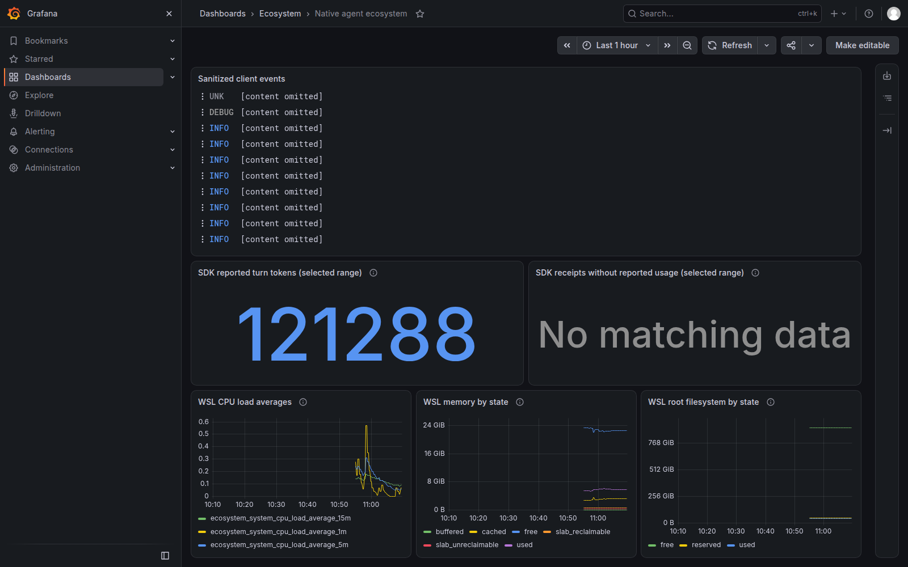

# Current-session native E2E — September 19, 2026

The fresh native SDK path now works end to end:
**Astra SDK → native Context Mode → native usage histogram → Collector →
Prometheus**, with the same task's atomic result receipt reaching **Loki and
Grafana**. Its exact total is **40,518 tokens**. The [machine-readable follow-up
receipt](followup-receipt.json) records commands, results, source evidence and limits.

The running Desktop parent is a separate boundary. Direct ai-memory retrieval
returned two scoped lifecycle observations, SocratiCode retrieved the relevant
usage-normalization code from the 139-chunk index, and the native Context Mode
bridge worked. This Desktop task exposes **zero direct Context Mode tools** and
has **zero correlated OTLP records** in the bounded check. Native child success
does not establish Desktop-parent exporter activation. Start/reload the intended
Desktop process normally, then observe its own export; the saved user config is
ready, but no hot-reload result is claimed.

## Exact native results

| Upstream operation | Observed result |
|---|---|
| Official Codex SDK `thread.turn(...).run()` | `completed`, Astra/OpenAI, 12,493 ms |
| Native Context Mode `ctx_execute` | One completed Python calculation; final JSON sum 42 / service_count 4 |
| Native SDK usage | Input 40,369, cached input 26,240 included in input, output 149, total 40,518 |
| Native Prometheus histogram query below | Six categories exactly matched the SDK: input40369, cached26240, output 149, total40518, cache-write0, reasoning0 |
| Automatic SDK observation writer → upstream `file_log` → Loki | New task's bounded receipt arrived without manual import |
| Loki receipt query over 6h | 121288 = prior 80770 + fresh 40518; three distinct receipt IDs |
| Native Collector `host_metrics` receiver | Eight metric families / 23 series for WSL CPU, memory, load and root filesystem |
| `promtool check rules` | `SUCCESS: 8 rules found` |
| Saved bridge `ctx_stats` | 50 calls over 9h55m, 208 KB entered context, **0 tokens saved** |

The earlier real Codex and Claude client runs, six backend persistence checks,
and firing/resolved local notification delivery remain in the [initial
receipt](receipt.json). This follow-up ran one new SDK inference, not another
Claude task. Native caches, user accounts and model choices remain in place.



## What fixed the SDK histogram

Upstream App Server defaults metrics off. The SDK launches that server without
its `--analytics-default-enabled` option. An explicit OTLP exporter alone did
not enable the metrics provider, which explains why the earlier interval/flush
experiment could not produce its histogram.

The native fix is the user-level setting below, alongside the already configured
local OTLP exporter. It was applied only where `analytics.enabled` was **unset**:

```toml
[analytics]
enabled = true

[otel]
metrics_exporter = { otlp-http = { endpoint = "http://127.0.0.1:14318/v1/metrics", protocol = "binary" } }
```

Merge the [complete example](collector/codex.toml.example) into the intended
user home; do not replace existing configuration or duplicate TOML tables.
Respect an existing explicit analytics opt-out. Separate native first-party
analytics events are enabled for both unset and true in this pinned source,
so this host's change preserved that existing behavior. It does **not** make
all telemetry local. See the pinned upstream [metrics gate](https://github.com/openai/codex/blob/rust-v0.155.1/codex-rs/core/src/otel_init.rs#L68),
[OTLP/Statsig selection](https://github.com/openai/codex/blob/rust-v0.155.1/codex-rs/otel/src/provider.rs#L267)
and [separate analytics gate](https://github.com/openai/codex/blob/rust-v0.155.1/codex-rs/analytics/src/client.rs#L239).

No SDK implementation patch, exporter-delay loop or proxy was needed. The
existing SDK example automatically wrote the fresh task's result receipt.

## Replay with upstream commands

Set explicit native paths as in the [SDK guide](../blueprints/us-equities/workers/README.md).
Run discovery before inference and choose a new private receipt path each time.
The task prompt asked for one Context Mode Python calculation of 17+25 and the
count of four service labels, with no files, network or delegation.

```bash
"$NATIVE_CODEX_BIN" app-server --help

"$SDK_ENV/bin/python" "$STACK_REPO/blueprints/us-equities/workers/native_worker.py" run \
  --codex-bin "$NATIVE_CODEX_BIN" --codex-home "$NATIVE_CODEX_HOME" \
  --workspace "$RESEARCH_WORKSPACE" --prompt "$PROMPT_FILE" \
  --receipt "$PRIVATE_RUN_DIR/sdk-live-receipt.json" --turn-deadline-seconds 90 \
  --observation-dir "$STACK_DATA_ROOT/sdk-receipts"

curl --fail --silent --get http://127.0.0.1:19090/api/v1/query \
  --data-urlencode 'query=last_over_time(ecosystem_codex_turn_token_usage_sum{client_scope="sdk-worker"}[6h])'

curl --fail --silent --get http://127.0.0.1:13100/loki/api/v1/query \
  --data-urlencode 'query=sum(max by (receipt_id) (max_over_time({service_name="codex-sdk-receipt"} | receipt_id != "" | unwrap total_token_count | __error__="" [6h])))'

curl --fail --silent --get http://127.0.0.1:19090/api/v1/query \
  --data-urlencode 'query=count by (__name__) ({__name__=~"ecosystem_system_.*"})'

mcporter --config "$MCPORTER_CONFIG" call context-mode.ctx_stats --output text --no-oauth
```

These queries are time-sensitive; stored observations have finite retention.
Do not repeat model calls merely to keep a graph populated. The dashboard now
uses its selected range for SDK receipts, with a separate missing-usage panel.
Empty data remains “No matching data,” not zero usage. It cannot identify tasks
that never emitted a receipt. The WSL root filesystem is a virtual disk, not a
measurement of available physical storage on Windows.

## Token and repository decisions

The bridge's saved zero-savings counter is a real upstream result. Its 50 calls
are a retained connection counter, not the entire Desktop task. The separate
**188,769 → 500** artifact comparison remains reproducible using upstream
`gpt-tokenizer 3.4.0` / `o200k_base`; it measures selected text, not provider
billing. Cached input is a subset of input. Do not add receipt totals, histogram
sums, cache reuse and compressor estimates together.

The refresh found no new public stars: all 337 are covered. The grand catalog now
contains 453 repository identities and 151 cards covering 146 distinct core repositories.
[node_exporter and OpenLIT](../catalogs/us-equities/source-followup.md) were added
as conditional alternatives. The existing Collector supplied host monitoring;
no duplicate exporter or model-observability platform was installed. Context
Mode, ai-memory, RTK and SocratiCode match the reviewed latest stable releases.
Source review is not installation or a universal state-of-the-art benchmark.

Remaining requirements are explicit: Desktop-parent activation, off-host
backup/paging and availability, receipt-spool retention/recovery, broker/data
access, and versioned strategy/risk/execution acceptance. None is established by
a healthy local monitor or a longer repository list.
